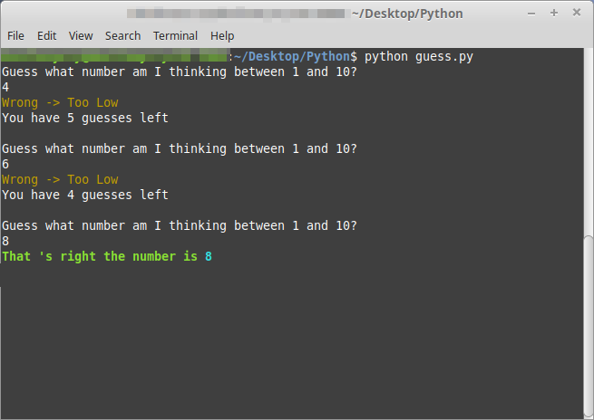

## Guess My Number

Guess my Number game for console / command prompt

## Built With

* [Python](https://www.python.org/) - Backend framework used
* [Rich](https://pypi.org/project/rich/) - Library used
* [GIMP](https://www.gimp.org/) - Image Manipulation program used

## Author

* **Damir Bubanović** - *Initial work* - [Github](https://github.com/damir-bubanovic)

## Creator Self Promo Links

Damir Bubanović

- **[GitHub](https://github.com/damir-bubanovic)**
- **[StackOwerflow](https://stackoverflow.com/users/11778242/damir-bubanovic)**
- **[Yahoo](damir.bubanovic@yahoo.com)**

## Acknowledgments

* Hat tip to anyone whose code was used
* Inspiration
* etc

